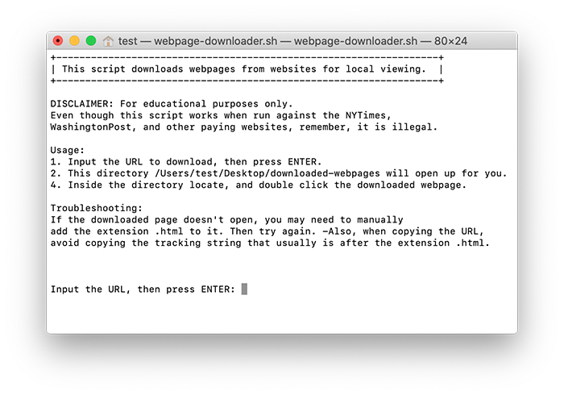

# WEBPAGE DOWNLOADER
This script downloads webpages to a local directory on the Desktop.

The script can live anywhere on a Mac OS X, or MacOS machine, but the downloaded page is set in stone at ~/Desktop/downloaded-webpages/. Once the page has been downloaded, the script opens this directory and then you locate the webpage and run it from there.

I have noticed that webpages from the WashingtonPost come down without extension file names, so simply add the ".html", so your browser can recognize it.

You can create your own sh script by copying and pasting the code from here (https://github.com/wwwhtml/webpage-downloader/blob/master/webpage-downloader.sh).

Questions? Good! ;)
